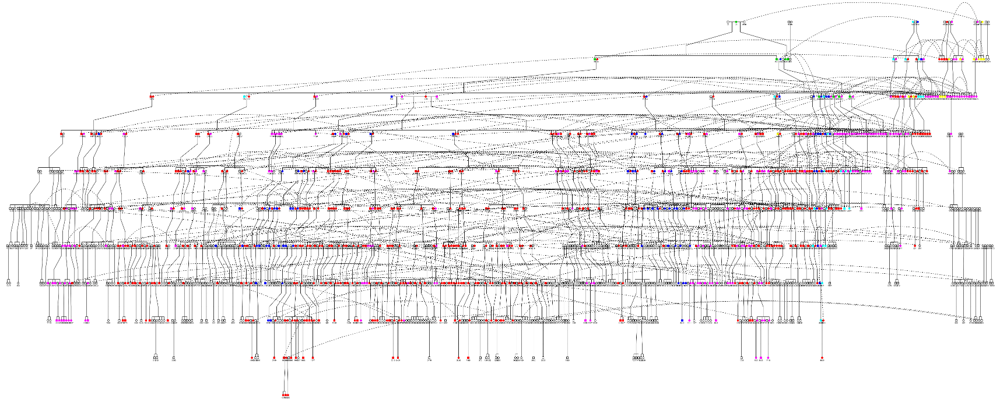

class: middle

```{r setup, include=FALSE}
options(htmltools.dir.version = FALSE)
options(knitr.table.format = "html") 
# require(DT)
```

# .center[Advocate for reproducible research...]

## .center[Where possible my presentations and code are available online]

<br />

<p>
.center[


]
</p>

<br />

.center[[sirselim.github.io/presentations](http://sirselim.github.io/presentations)]

---
class: middle inverse

# Me...

---
layout: false

background-image: url("images/taranaki.jpg")
background-size: cover

---
class: middle

<p> 
.center[]
</p>

---
class: middle

<p> 
.center[]
</p>

---
class: middle inverse

# Undergrad (2004 - 2007)

## Victoria University of Wellington (VUW)

### <span style="color:#3498DB">BBMedSci (Human Genetics, Molecular Pathology)</span>

---
layout: false

background-image: url("images/dna.jpg")
background-size: cover

---
class: center

## Human Genome Project (1990 - 2003)

<p> 
.center[]
</p>

<p style="font-size: 14px">
.center[
<a href="http://humangenomeproject.yolasite.com/impact.php" target="blank">http://humangenomeproject.yolasite.com/impact.php</a>
]
</p>

---
class: middle

### The Human Genome

  - ~3 billion base pairs (A, T, C, G)
  - organised into 23 pairs of chromosomes  
  
  - it took ~13 years to 'complete' the genome project
  - at a cost of $3 billion USD
    + yep, that's a $ per letter!

<br>

.center[**Remember a few of these stats, we'll revisit later on...**]

---
class: middle inverse

# MSc (2007 - 2009)

## Environmental Science and Research (ESR) & VUW

### <span style="color:#3498DB">Started off as Cell and Molecular Biology...</span>

---
class: middle inverse

<p>
.center[


]
</p>

---
class: middle

# Mitochondria - and their DNA!

---
class: middle inverse

### Seven daughters of Eve (Bryan Sykes)

<p> 
.center[]
</p>

.center[.small[*First PCR machine (cool story!)]]

---
class: middle

<p> 
.center[]
</p>

---
class: middle

<p> 
.center[]
</p>

---
class: middle

## My Masters project

* We performed the first complete mtDNA sequencing in NZ Māori:  
  * population genetics (more diversity)
  * health outcomes (some interesting results)

<br>

* Using a technology called a microarray

* turns out this was 'flawed' and the software was TERRIBLE
  * so I had to improvise/'hack'

---
class: middle

<p> 
.center[]
</p>

---
class: middle

<p> 
.center[]
</p>

---
class: middle

<p> 
.center[]
</p>

---
class: middle

<p> 
.center[]
</p>

---
class: middle

<p> 
.center[]
</p>

---
class: middle inverse

.large[The introduction of this <span style="color:#3498DB">*in-silico*</span> aspect into my project really grabbed me...]

<br>

.large[...so I started making the move from the wetlab/bench...]

<br>

.pull-right[.large[...to <span style="color:#3498DB">computers</span>...]]

---
class: middle

<p> 
.center[]
</p>

---
class: middle inverse

# PhD (2010 - 2014)

## Griffith University, Gold Coast, Australia

### <span style="color:#3498DB">Bioinformatics (*using computers to solve biological problems*)</span>

---
class: middle inverse

<p>
.center[


]
</p>

---

<p> 
.center[]
</p>

<p style="font-size: 14px">
.center[
<a href="http://biocomicals.blogspot.com/2011/05/thats-what-bioinformaticians-do.html" target="blank">http://biocomicals.blogspot.com/</a>
]
</p>

---
class: inverse middle

.large[...it starts with...]

# NORFOLK ISLAND

---
class: middle inverse

<p> 
.center[]
</p>

---
class: middle inverse

<p> 
.center[]
</p>

---
class: middle inverse

<p> 
.center[]
</p>

---
class: middle center

```{r out.width='100%', fig.height=8.25, eval=require('leaflet'), echo = F}
library(leaflet)
leaflet() %>% 
addTiles() %>% 
setView(-180.65, -26.0285, zoom = 3) %>%
addMarkers(lng=-192.038, lat=-29.0285, label="Norfolk Island", labelOptions = labelOptions(noHide = F)) %>%
#addMarkers(lng=-185.268, lat=-36.852, popup="The birthplace of R") %>%
addMarkers(lng=-128.3242, lat=-24.3768, label="Pitcairn Islands", labelOptions = labelOptions(noHide = F)) %>%
addMarkers(lng=-149.4260, lat=-17.6509, label="Tahiti", labelOptions = labelOptions(noHide = F)) %>%
addMarkers(lng=-359.25, lat=52.3555, label="England", labelOptions = labelOptions(noHide = F)) %>%
addMarkers(lng=-240, lat=-2.25, label="Indonesia", labelOptions = labelOptions(noHide = F))
```

---
class: inverse middle center

<p> 
.center[]
</p>

40% of current population haplogroup <span style="color:lightblue">B4a1a[...]</span><br />

<p style="font-size: 14px">Benton MC <i>et al.,:</i> <a href="https://investigativegenetics.biomedcentral.com/articles/10.1186/s13323-015-0028-9" target="blank"><i>“Mutiny on the Bounty”: the genetic history of Norfolk Island reveals extreme gender-biased admixture.</i></a> Investigative Genetics 2015, 6:11.</p>

---
class: middle

.center[.large[Specific female mtDNA trees]]

<p> 
.center[]
</p>

---
class: middle

.center[.large[Specific female mtDNA trees]]

<p> 
.center[]
</p>

---
class: middle

.center[.large[Specific female mtDNA trees]]

<p> 
.center[]
</p>

---
class: inverse

### <span style="color:lightblue">My PhD took me from basic GWAS...</span>

<span style="color:#3498DB">**Benton MC**</span>, Lea RA, <span style="color:#3498DB">**Macartney-Coxson D**</span>, Carless MA, Bellis C, Hanna M, Eccles D, Chambers GK, Curran JE, Blangero J and Griffiths LR. (2015) *Serum bilirubin concentration is modified by UGT1A1 Haplotypes and Influences Risk of Type-2 Diabetes in the Norfolk Island Genetic Isolate*. **BMC Genetics** 16(1) [[article]](http://www.biomedcentral.com/1471-2156/16/136)

--

### <span style="color:lightblue">through integrative 'omics...</span>

<span style="color:#3498DB">**Benton MC**</span>, Lea RA, <span style="color:#3498DB">**Macartney-Coxson D**</span>, Carless MA, Göring HH, Bellis C, Hanna M, Eccles D, Chambers GK, Curran JE, Harper JL, Blangero J and Griffiths LR. (2013) *Mapping eQTLs in the Norfolk Island Genetic Isolate Identifies Candidate Genes for CVD-risk Traits*. **American Journal of Human Genetics** 93(6): 1087-99 [[article]](http://www.ncbi.nlm.nih.gov/pmc/articles/PMC3853002/)

--

### <span style="color:lightblue">and the application of 'outside-of-the-box' statistical approaches...</span>

<span style="color:#3498DB">**Benton MC**</span>, Lea RA, <span style="color:#3498DB">**Macartney-Coxson D**</span>, Carless MA, Göring HH, Bellis C, Hanna M, Eccles D, Chambers GK, Curran JE, Harper JL, Blangero J and Griffiths LR. (2015) *A phenomic scan of the Norfolk Island genetic isolate identifies a major pleiotropic effect locus associated with renal disorder markers*. **PLoS Genetics** 11(10) [[article]](http://journals.plos.org/plosgenetics/article?id=10.1371/journal.pgen.1005593)

---
class: middle

# so bioinformatics also means <span style="color:#3498DB">'freedom'</span>...

---
layout: false

background-image: url("images/coffee.jpg")
background-size: cover

---
class: middle inverse

# PostDoc (2014 - 2018)

## Queensland University of Technology, Brisbane, Australia<sup>*</sup>

### <span style="color:#3498DB">Research Fellow</span>

----

<sup>*</sup>but I worked remotely (from home/Wellington) - that freedom again!

---
layout: false

background-image: url("images/x10.png")
background-size: cover

---
class: top

<br>

# Whole Genome Sequencing 

.center[.large[let's revisit the idea of time and cost...]]

--

* can now do a genome in <span style="color:#3498DB">**<24 hours**</span>...

* ...for <span style="color:#3498DB">**~$1000 USD**</span>

<br>

--

# Norfolk Island Whole Genome Sequencing

* sequenced 108 individuals

--

* progress to date:

  * founder variants

  * glaucoma

---
class: middle

<p> 
.center[]
</p>

---
layout: false

background-image: url("images/proton2.jpg")
background-size: cover

---
class: middle

# Diagnostics Lab

.large[Gene panel and Exome Sequencing (accredited - neurological disorders)]

<br>

## VCF-DART (my pipeline)

* used to manually work through 30-60K rows of data in excel!

* could take 4-8 weeks to identify and validate variant(s)

<br>

* now can have a short list of variants in <span style="color:#3498DB">**1 day**</span> 

* validation in <span style="color:#3498DB">**<2 weeks**</span>!

---
class: middle inverse

# The next "big" thing in <span style="color:#3498DB">next-generation sequencing</span>?

---
class: middle

<p> 
.center[]
</p>

---
class: middle

<p> 
.center[]
</p>

---
class: middle

<p> 
.center[]
</p>

---
class: middle inverse

# Epigenetics

<br>

.large[<span style="color:#3498DB">the punctuation of the genome</span>]

---
class: middle

<p> 
.center[]
</p>

---
class: middle

<p> 
.center[]
</p>

---
class: middle inverse

# Methylation and Aging

---
class: middle

<p> 
.center[]
</p>

---
class: middle inverse

<p> 
.center[]
</p>

---
class: middle inverse

# ESR (July 2018 - )

## Wellington (Porirua), NZ

### <span style="color:#3498DB">Senior Scientist Bioinformatics and Data Science</span>

---
layout: false

background-image: url("images/desk.jpg")
background-size: cover

---
class: middle

# I now have students of my own!

<br>

## <span style="color:#3498DB">Martha Aquino</span> (Honours, QUT)

<br>

## <span style="color:#3498DB">Alessandra Santana</span> (PhD, UoO & ESR)

---
class: middle inverse

<p> 
.center[]
</p>

---
class: middle inverse

<p>
.huge[.center[<b>Thank you!</b>]]
<br>
</p>