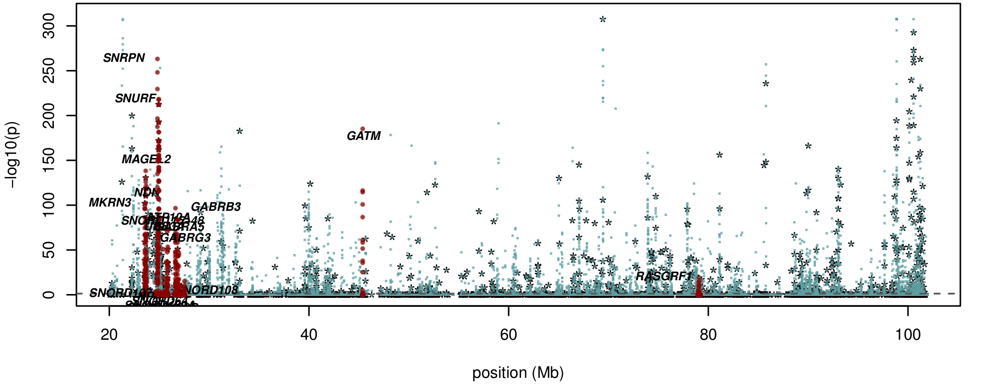
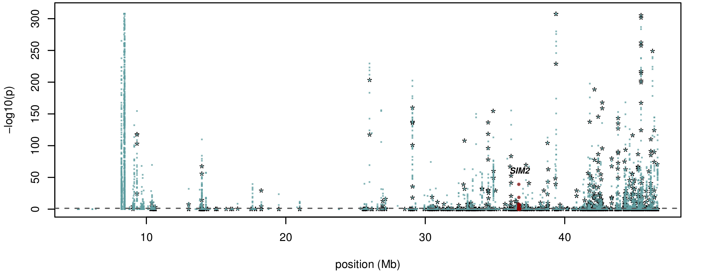
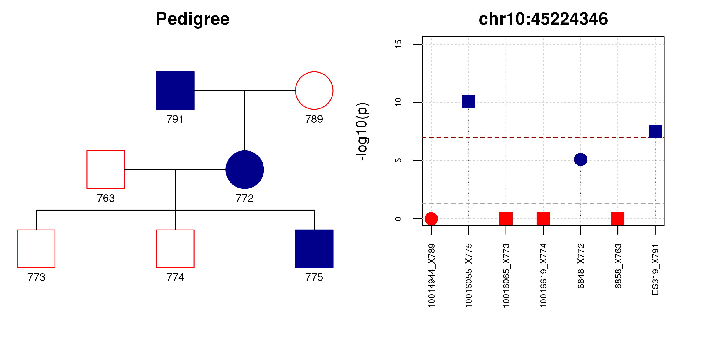
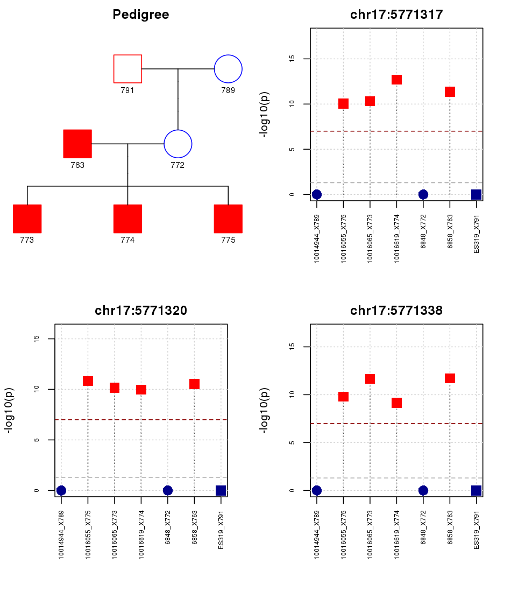

class: middle

```{r setup, include=FALSE}
options(htmltools.dir.version = FALSE)
options(knitr.table.format = "html") 
# require(DT)
```

# .center[My presentation available online]

<br />

<p>
.center[
<!--  -->


]
</p>

<br />

.center[[sirselim.github.io/presentations](http://sirselim.github.io/presentations)]

---
class: inverse middle

# NORFOLK ISLAND

.large[...a little story time...]

---
class: inverse middle center

<p>
.center[]
</p>

---
class: middle center

```{r out.width='100%', fig.height=8.25, eval=require('leaflet'), echo = F}
library(leaflet)
leaflet() %>% 
addTiles() %>% 
setView(-180.65, -26.0285, zoom = 3) %>%
addMarkers(lng=-192.038, lat=-29.0285, label="Norfolk Island", labelOptions = labelOptions(noHide = F)) %>%
#addMarkers(lng=-185.268, lat=-36.852, popup="The birthplace of R") %>%
addMarkers(lng=-128.3242, lat=-24.3768, label="Pitcairn Islands", labelOptions = labelOptions(noHide = F)) %>%
addMarkers(lng=-149.4260, lat=-17.6509, label="Tahiti", labelOptions = labelOptions(noHide = F)) %>%
addMarkers(lng=-359.25, lat=52.3555, label="England", labelOptions = labelOptions(noHide = F)) %>%
addMarkers(lng=-240, lat=-2.25, label="Indonesia", labelOptions = labelOptions(noHide = F))
```

---
class: inverse middle center

<p>
.center[]
</p>

<p style="font-size: 14px">Macgregor S <i>et al.,:</i> <a href="https://www.ncbi.nlm.nih.gov/pmc/articles/PMC2987173/" target="blank"><i>Legacy of mutiny on the Bounty: founder effect and admixture on Norfolk Island.</i></a> Eur J Hum Genet. 2010; 18: 67–72.</p>

---
class: inverse middle center

<p> 
.center[]
</p>

40% of current population haplogroup <span style="color:lightblue">B4a1a[...]</span><br />

<p style="font-size: 14px">Benton MC <i>et al.,:</i> <a href="https://investigativegenetics.biomedcentral.com/articles/10.1186/s13323-015-0028-9" target="blank"><i>“Mutiny on the Bounty”: the genetic history of Norfolk Island reveals extreme gender-biased admixture.</i></a> Investigative Genetics 2015, 6:11.</p>

---
class: middle inverse

# Founder Effect Variants

<p style="font-size: 20px">
Other contributors: <span style="color:lightblue">Rod Lea, David Eccles, Donia Macartney-Coxson, Heidi Sutherland, Larisa Haupt, Lyn Griffiths</span>
</p>

---

## Whole Genome Sequencing

.medium[
<span style="color:darkblue">**N=108**</span> core pedigree individuals sequenced  

Platform – **Illumina HiSeq-X10 (Garvan)**  

Bioinformatics: 
  - BOWTIE2 –> SAMTOOLS -> VCF annotation –> dbSNP -> dbNSFP -> VEP -> custom beds    

Coverage >25X
]

--

## Functional Founder Effect Variants

.medium[
<span style="color:darkblue">**Functional**</span> = Predicted damaging in *in silico* tests:
  - SIFT, POLYPHEN2, MUTATIONTASTER, PROVEAN, MUTATION ASSESSOR, CADD
  
<span style="color:darkblue">**Founder effect**</span> = increased allele freq in NI compared to general population
  - (MAF<0.01% in 1000G >5% in NI)

<span style="color:darkblue">**Variant**</span> = single nucleotide variant (SNV)
]

---

```{r live_datatable, message = F, echo = F, warnings = F}
var.data <- read.table('data/founder_variants.txt', head = T, stringsAsFactors = F)

DT::datatable(
  var.data, filter = "bottom",
  selection = 'multiple', 
  rownames = FALSE,
  options = list(orderClasses = TRUE, lengthMenu = c(5, 10), pageLength = 10, server = FALSE)
)
```

---
class: middle

# *ACOT4* (Acyl-CoA Thioesterase 4)

  - <span style="color:darkblue">**regulation of lipid metabolism**</span>
  
  - SNV = rs77408762 (T/A)
  
  - Chr14, pos 73593812 (Hg38)
  
  - Amino acid = p.TYR190ASN
  
  - freq A = 0.0099 (EUR), 0 (AFR) and 0 (EAS) 
  
  - freq A in NI = 0.26

<br />

.center[**Rare allele most likely came from England via Bounty Mutineers and then increased in frequency in NI due to founder effect**]

---
class: middle center


---
class: middle 

.center[## *de novo* SNVs]

### 3 variants meeting the 'damaging' criteria, >5% MAF in NI, all missense

  - *JPH2* (<span style="color:darkblue">Junctophilin 2</span>) 
    + chr20:44186654; c.52T>G; p.Trp18Gly; [48 hets, **MAF=0.22**]  
    + mutations previously linked to inherited cardiomyopathy (Landstrom *et al*, 2007)

<br />

  - *EPS15L1* (<span style="color:darkblue">Epidermal growth factor receptor substrate 15-like 1</span>) 
    + Chr19:16425252; c.623T>C; p.Leu208Pro; [35 hets, **MAF=0.16**]  

<br />

  - *UGT2B4* (<span style="color:darkblue">UDP glucuronosyltransferase 2 family, polypeptide B4</span>) 
    + chr4:69480794; c.1427T>A; p.Leu476His; [12 hets, **MAF=0.06**]

---
class: middle

# Summary

<br >

.large[

  - Using WGS and founder effect in NI may reveal disease-related variants that are rare in general populations

<br >

  - Focusing on “functional” SNVs has identified strong candidate variants  
  
    + performing genotyping in the rest of the pedigree

<br >

  - Some early evidence of association with T2D and CVD-related traits

]

---
class: middle inverse

# Allele-Specific Methylation

<p style="font-size: 20px">
Other contributors: <span style="color:lightblue">Rod Lea, Donia Macartney-Coxson, Nicole White, Daniel Kennedy, Heidi Sutherland, Larisa Haupt, Kerrie Mengersen, Lyn Griffiths</span>
</p>

---
class: middle center

# Methylation - the punctuation of the genome


---
class: middle inverse

.large[<b>Allele-specific methylation (ASM):</b>  

  - same cytosine is differentially methylated on the <span style="color:lightblue"><b>two alleles</b></span> of a diploid organism]  

.large[ASM is a major mechanism of <span style="color:lightblue"><b>genomic imprinting</b></span> (aberrations can lead to disease)]

.center[


<p style="font-size: 12px">image rights: Renfree MB <i>et al.,:</i> <a href="http://rstb.royalsocietypublishing.org/content/368/1609/20120151" target="blank"><i>“The origin and evolution of genomic imprinting and viviparity in mammals.</i></a> 2012</p>

]

---

### Identification of allele-specific methylation profiles across generations

measuring genome-wide allele-specific methylation (ASM)

  - NGS bisulphite sequencing
  - SeqCap Epi CpGiant (Illumina HiSeq)
  
collected data for <span style="color:darkblue"><b>108</b></span> NI individuals</li> 

  - comprising a close 3 generation pedigree

<br />

--

fully customised QC and analysis pipeline:<span style="color:darkblue"><b>*</b></span>

  - fastqc, trimgalore
  - bismark, sambamba, picard tools
  - methpipe (ASM estimation)
  - MethylDackel (originally PileOMeth), R and methylkit
  - Shiny webserver visualisation

parallel processing enabled for local and remote machines

.center[
<span style="color:darkblue; font-size: 75%"><b>*<i>once wrangled into shape scripts will be accessible via GitHub</i></b></span>
]

---
class: center middle

## Chromosome 15



.small[**15q11-q13**: Angelman syndrome (maternally active allele) | Prader-Willi syndrome (paternally active allele)]

---
class: center middle

## Chromosome 21



.small[***WRB*** is found to be maternally imprinted]

---
class: inverse

# Allele-specific Methylated Regions (AMRs)

#### Overlap with known imprinting genes

  - there are <span style="color:lightblue"><b>91</b></span> known imprinted genes with strong evidence
  - we have identified <span style="color:lightblue"><b>12761</b></span> total AMR (>=2 CpG sites)
  - we recoup 72/91 <span style="color:lightblue"><b>79%</b></span>) of the above known genes

--

#### Small AMRs (>=2 CpG sites and <= 200bp length)

  - there are <span style="color:lightblue"><b>4731 small AMR</b></span> which collectively span 6987 genomic features
  - <span style="color:lightblue"><b>35.8%</b></span> promoter related 

--

#### Large AMRs (>=200bp length)

  - <span style="color:lightblue"><b>11 large AMR</b></span> (spanning some really interesting regions, i.e. *PCDH*, *HOX*)

--

#### Genetic variation across AMR

  - <span style="color:lightblue"><b>2,388</b></span> AMR have no common SNPs (little genetic variation

---
class: middle center


```{r, echo = F, cache=TRUE, message=FALSE, warning=FALSE}
options(DT.options = list(pageLength = 12))
#
all.data <- read.table('data/table_data.txt', head = T)
# only display the table, and nothing else
DT::datatable(all.data, rownames = FALSE, selection = 'multiple', 
              options = list(dom = 't', columnDefs = list(list(className = 'dt-left', targets = "_all"))))
```

---
class: middle inverse

# Inheritance of Allele-Specfic Methylation?

---
class: middle center


<p style="text-align: center; font-size: 18px;">
<b>ASM plot of chromosome 20 for a nuclear family</b> (<span style="color:darkred"><b>father</b></span>, <span style="color:pink"><b>mother</b></span>, <span style="color:lightblue"><b>son</b></span>, <span style="color:green"><b>daughter</b></span>)
</p>

---
class: middle center



---
class: middle center



---
class: middle inverse

# Summary
.large[
  - implemented a custom bioinformatic pipeline  
]
<br />
.large[
  - generated a genome-wide 'map' of AMRs  
  
    + allows exploration of the genomic landscape and features
]
<br />
.large[
  - identified **ASM hotspots** overlapping non-coding RNA and other important functional loci  
  
    + **might account for the number of GWAS hits outside of genes?**
]

---
class: inverse

## Acknowledgments

.pull-left[.medium[
#### <span style="color:lightblue">QUT</span>  
Lyn Griffiths  
Rod Lea  
Larisa Haupt  
Heidi Sutherland  
Michelle Hanna  
...the rest of the GRC IHBI lab group  
Nicole White  
Daniel Kennedy  
Kerrie Mengersen

<span style="color:lightblue">**WGS sequencing:**</span> Garvan Institute of Medical Research / Kinghorn Centre for Clinical Genomics  

<span style="color:lightblue">**Funding:**</span> NHMRC
]]

.pull-right[.medium[
#### <span style="color:lightblue">STDOI @ UTRGV</span?
John Blangero  
Joanne Curran  
Harald Goring  

Greg Gibson (Georgia Institute of Technology, USA)  
Melanie Carless (Texas Biomedical Research Institute)  
Claire Bellis (Genome Institute of Singapore)  

#### <span style="color:lightblue">NZ collaborators</span>
Donia Macartney-Coxson (ESR)  
David Eccles (Gringene Bioinformatics)  
Geoff Chambers (VUW)
]]

<br />

.large[.center[<b>The people of Norfolk Island who who volunteered for this study.</b>]]

---
class: middle center inverse

background-image: url(images/IMG_1127.JPG)
background-size: cover

.large[# Thanks, any questions?]

<br />
<br />
<br />
<br />
<br />
<br />
<br />
<br />
