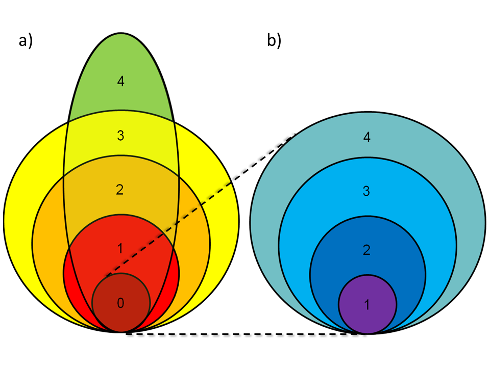

class: middle hide_logo

```{r setup, include=FALSE}
options(htmltools.dir.version = FALSE)
options(knitr.table.format = "html") 
# require(DT)
xaringanExtra::use_xaringan_extra(c("tile_view", "animate_css", "tachyons", "panelset"))
```

```{r xaringan-logo, echo=FALSE}
# use logo
xaringanExtra::use_logo(
  image_url = "https://upload.wikimedia.org/wikipedia/commons/6/66/ESR_SFC_logo.png",
  width = "138px",
  height = "87px",
  position = xaringanExtra::css_position(bottom = "1px", right = "1.5em"),
  link_url = "https://www.esr.cri.nz/",
  exclude_class = c("title-slide", "inverse", "hide_logo")
)
```

# .center[Advocate for reproducible research...]

## .center[Where possible my presentations and code are available online]

<br />

<p>
.center[


]
</p>

<br />

.center[[sirselim.github.io/presentations](http://sirselim.github.io/presentations)]

<!-- SVG Icons are from https://simpleicons.org -->
<footer class="pv3 ph3 ph5-ns tc">
  <a class="link near-black hover-blue dib h2 w2 mr3" href="https://github.com/sirselim" title="GitHub">
    <svg fill="currentColor" xmlns="http://www.w3.org/2000/svg" viewBox="0 0 16 16" fill-rule="evenodd" clip-rule="evenodd" stroke-linejoin="round" stroke-miterlimit="1.414"><path d="M8 0C3.58 0 0 3.582 0 8c0 3.535 2.292 6.533 5.47 7.59.4.075.547-.172.547-.385 0-.19-.007-.693-.01-1.36-2.226.483-2.695-1.073-2.695-1.073-.364-.924-.89-1.17-.89-1.17-.725-.496.056-.486.056-.486.803.056 1.225.824 1.225.824.714 1.223 1.873.87 2.33.665.072-.517.278-.87.507-1.07-1.777-.2-3.644-.888-3.644-3.953 0-.873.31-1.587.823-2.147-.083-.202-.358-1.015.077-2.117 0 0 .672-.215 2.2.82.638-.178 1.323-.266 2.003-.27.68.004 1.364.092 2.003.27 1.527-1.035 2.198-.82 2.198-.82.437 1.102.163 1.915.08 2.117.513.56.823 1.274.823 2.147 0 3.073-1.87 3.75-3.653 3.947.287.246.543.735.543 1.48 0 1.07-.01 1.933-.01 2.195 0 .215.144.463.55.385C13.71 14.53 16 11.534 16 8c0-4.418-3.582-8-8-8"/></svg>
  </a>
  <a class="link hover-blue near-black dib h2 w2 mr3" href="https://twitter.com/miles_benton" title="Twitter">
    <svg fill="currentColor" xmlns="http://www.w3.org/2000/svg" viewBox="0 0 16 16" fill-rule="evenodd" clip-rule="evenodd" stroke-linejoin="round" stroke-miterlimit="1.414"><path d="M16 3.038c-.59.26-1.22.437-1.885.517.677-.407 1.198-1.05 1.443-1.816-.634.375-1.337.648-2.085.795-.598-.638-1.45-1.036-2.396-1.036-1.812 0-3.282 1.468-3.282 3.28 0 .258.03.51.085.75C5.152 5.39 2.733 4.084 1.114 2.1.83 2.583.67 3.147.67 3.75c0 1.14.58 2.143 1.46 2.732-.538-.017-1.045-.165-1.487-.41v.04c0 1.59 1.13 2.918 2.633 3.22-.276.074-.566.114-.865.114-.21 0-.416-.02-.617-.058.418 1.304 1.63 2.253 3.067 2.28-1.124.88-2.54 1.404-4.077 1.404-.265 0-.526-.015-.783-.045 1.453.93 3.178 1.474 5.032 1.474 6.038 0 9.34-5 9.34-9.338 0-.143-.004-.284-.01-.425.64-.463 1.198-1.04 1.638-1.7z" fill-rule="nonzero"/></svg>
  </a>
  <a class="link hover-blue near-black dib h2 w2 mr3" href="https://scholar.google.co.nz/citations?user=iEhBavEAAAAJ&hl=en" title="Google Scholar">
    <svg fill="currentColor" xmlns="http://www.w3.org/2000/svg" viewBox="0 0 24 24" fill-rule="evenodd" clip-rule="evenodd" stroke-linejoin="round" stroke-miterlimit="1.414"><path d="M12 24a7 7 0 1 1 0-14 7 7 0 0 1 0 14zm0-24L0 9.5l4.838 3.94A8 8 0 0 1 12 9a8 8 0 0 1 7.162 4.44L24 9.5z" fill-rule="nonzero"/></svg>
  </a>
  <a class="link hover-blue near-black dib h2 w2 mr3" href="http://orcid.org/0000-0003-3442-965X" title="ORCID">
    <svg fill="currentColor" xmlns="http://www.w3.org/2000/svg" viewBox="0 0 24 24" fill-rule="evenodd" clip-rule="evenodd" stroke-linejoin="round" stroke-miterlimit="1.414"><path d="M12 0C5.372 0 0 5.372 0 12s5.372 12 12 12 12-5.372 12-12S18.628 0 12 0zM7.369 4.378c.525 0 .947.431.947.947s-.422.947-.947.947a.95.95 0 0 1-.947-.947c0-.525.422-.947.947-.947zm-.722 3.038h1.444v10.041H6.647V7.416zm3.562 0h3.9c3.712 0 5.344 2.653 5.344 5.025 0 2.578-2.016 5.025-5.325 5.025h-3.919V7.416zm1.444 1.303v7.444h2.297c3.272 0 4.022-2.484 4.022-3.722 0-2.016-1.284-3.722-4.097-3.722h-2.222z" fill-rule="nonzero"/></svg>
  </a>
</footer>

---
class: top

# acknowledgements

<div class="dt dt--fixed">
  <div class="dtc tc pv4 bg-white">
    <article class="mw5 center bg-white br3 pa3 pa4-ns mv3 ba b--black-10">
      <div class="tc">
        
        <h4 class="f3 mb2">Leah Kemp</h4>
        <h4 class="f5 fw4 gray mt0">(ESR)</h4>
      </div>
    </article>
  </div>
  <div class="dtc tc pv4 bg-white">
    <article class="mw5 center bg-white br3 pa3 pa4-ns mv3 ba b--black-10">
      <div class="tc">
        
        <h4 class="f3 mb2">Joep de Ligt</h4>
        <h4 class="f5 fw4 gray mt0">(ESR)</h4>
      </div>
    </article>
  </div>
  <div class="dtc tc pv4 bg-white">
    <article class="mw5 center bg-white br3 pa3 pa4-ns mv3 ba b--black-10">
      <div class="tc">
        
        <h4 class="f3 mb2">Donia Macartney-Coxson</h4>
        <h4 class="f5 fw4 gray mt0">(ESR)</h4>
      </div>
    </article>
  </div>
</div>

---
class: middle

# Talk Outline

[1]. <span style="color:#3498DB">**One year ago...**</span>
  * my journey → ESR → VCF-DART  

[2]. <span style="color:#3498DB">**Current day**</span>
  * wfl → GPUs → lots of data

[3]. <span style="color:#3498DB">**Scout tool**</span>
  * {Interactive demo}

[4]. <span style="color:#3498DB">**Moving forwards?**</span>

---
class: middle inverse

# QUT (February 2014 - June 2018)

## Brisbane (QLD), Australia

### <span style="color:#3498DB">PostDoc Research Fellow</span>

<p>
.center[


]
</p>

---
class: inverse

background-image: url("images/proton2.jpg")
background-size: cover

---
class: middle

# Diagnostics Lab

.large[Gene panel and Exome Sequencing (NATA accredited - neurological disorders)]

<br>

## Sanger -> Gene panel -> Exome

* move to WES -> increase in variants
* manual approach through 30-60K rows of data in **Excel**
* increased time to identify and validate variant(s)

---
class: middle inverse

# VCF-DART - what it's not...

It is **NOT** a variant calling and quality control pipeline

... it's about data

---

# Overview

<p> 
.center[]
</p>

---

# Variant tiers

<p> 
.center[]
</p>

---
class: middle inverse

# "Module 1" - VCF-DART

.large[(<span style="color:#3498DB">**V**</span>ariant <span style="color:#3498DB">**C**</span>all <span style="color:#3498DB">**F**</span>ormat - <span style="color:#3498DB">**D**</span>iagnostic <span style="color:#3498DB">**a**</span>nd <span style="color:#3498DB">**R**</span>eporting <span style="color:#3498DB">**T**</span>ool)]

---
layout: false

background-image: url("images/vcfdart_1.png")
background-size: contain

---
layout: false

background-image: url("images/vcfdart_2.png")
background-size: contain

---
class: middle

# Run-time

.huge[30-50K variants (avg Proton exome VCF):]

  - 6-10 mins (24 core 256GB RAM)
  - 17-23 mins (4 core 12GB RAM)

---
class: middle inverse

# "Module 2" - VCF-DART Viewer

---
layout: false

background-image: url("images/backup_1.png")
background-size: contain

---
layout: false

background-image: url("images/backup_2.png")
background-size: contain

---
layout: false

background-image: url("images/backup_3.png")
background-size: contain

---
layout: false

background-image: url("images/backup_4.png")
background-size: contain

---
layout: false

background-image: url("images/backup_5.png")
background-size: contain

---
layout: false

background-image: url("images/backup_6.png")
background-size: contain

---
class: 

<p> 
.center[]
</p>

Spun up VM to give reviewers a chance to ~~break~~ test things.

* using 6 public exomes (1000G)

<br>

--

.large[**Allocated VM:**]

* Ubuntu 18.08
* 4 cores
* 12GB RAM
* 30GB root
* 120GB ephemeral disk

--

<br>

...so it can scale down to quite reasonable specs...

---
class: middle

## VCF-DART in the lab

* much quicker time to variant shortlist and curation 
* can get to validation sooner (if required)
* meaning report delivered faster

## Summary

* open source
* modular (tools and databases)
* scalable (laptops -> servers)
* easy to deploy and use [soon to become easier]
* versioning 

---
class: middle inverse

## Current state of play (as of a year ago...)

* exciting times!

* cancer genomics - Auckland University (Prof Cristin Print), Genomics Aotearoa

* merging 'pipelines' to offer a flexible, unified and freely distributed system across NZ

* accreditation

<p>
.center[


]
</p>

---
class: middle

## Availability / Deployment

<br>

.large[Working on a wide range of deployment options:]

<br>

<p>
.center[


]
</p>

---
class: middle inverse

# to-do

* &#10004; ~~submit~~ manuscript - accepted (The Journal of Molecular Diagnostics) 
* &#10004; [release to the wild - GitHub (anyone interested can help out)](https://github.com/sirselim/WES_ShinyDiscover)
* finish implementing ClinGen & ClinVar links
* option for GnomAD-beta
* refactoring main code base (snakemake)
* complete docker/singularity version
* continue developing documentation!
* work with clinicians to further develop and refine

---
class: middle inverse

# to-do (SPOILER: the goal posts have shifted!)

* &#10004; ~~submit~~ manuscript - accepted (The Journal of Molecular Diagnostics) 
* &#10004; ~~[release to the wild - GitHub (anyone interested can help out)](https://github.com/sirselim/WES_ShinyDiscover)~~
* ~~finish implementing ClinGen & ClinVar links~~
* ~~option for GnomAD-beta~~
* ~~refactoring main code base (snakemake)~~
* ~~complete docker/singularity version~~
* ~~continue developing documentation!~~
* ~~work with clinicians to further develop and refine~~

---
class: middle inverse

# What a difference a year makes...

.huge[<span style="color:#3498DB">**Human Genomics at ESR**</span>]

---

# What do we do?

* our own research

<br>

* contract(s) with CCDHB Wellington Regional Genetics Lab

<br>

* providing support to CCDHB for Clinical Genomics GA project (Stephen Robertson)

<br>

* clinical research collaboration with local clinician (Richard Carroll) - hyperparathyroidism
  * sequencing 100 exomes
  * engaging clinicians from other DHBs
  * exploring the replacement of gene panels with exome/genome

---
class: top

# Complete Overhaul! [Leah Kemp]

<br>

<article class="cf">
  <div class="fl w-100 w-50-ns bg-white">
    <br>
    <br>
    <br>
    <ul>
      <li>Alignment and Variant Calling Workflow</li>
        <ul>
          <li><a href="https://github.com/ESR-NZ/human_genomics_pipeline" target="blank">[human_genomics_pipeline]</a></li>
        </ul>
    <br>
    <br>
      <li>Variant Annotation Workflow</li> 
        <ul>
          <li><a href="https://github.com/ESR-NZ/vcf_annotation_pipeline" target="blank">[annotation_pipeline]</a></li>
        </ul>
    </ul>
  </div>
  <div class="fl w-100 w-50-ns bg-white tc">
  <article class="mw5 center bg-white br3 pa3 pa4-ns mv3 ba b--black-10">
    <div class="tc">
      
      <h4 class="f3 mb2">Leah Kemp</h4>
      <h4 class="f5 fw4 gray mt0">(ESR)</h4>
    </div>
  </article>
  </div>
</article>

.center[.huge[ESR GitHub: [https://github.com/ESR-NZ](https://github.com/ESR-NZ)]]

---
class: top

# Current situation

* we have automated, reproducible, deployable pipelines
  - workflow language, containers and package managers

<br>

* depending on the resources you deploy on you can get fairly reasonable "turn-around"
  - 8-12 hours per 100X coverage exome
  - ~30-40 hours for a 30X coverage genome
    - time obviously increases with coverage

<br>

* having access to decent compute means these can run in parallel
  - so depending on resources you might:
      + run 10 exomes at once
      + run 4 - 8 genomes at once
  - this means you get more finishing in the time it takes to process one

---
class: middle inverse

# We can go faster!

<br>

.huge[... thanks to eResearch 2020]

---
class: middle

# ...enter [Nvidia Clara Parabricks](https://www.nvidia.com/en-us/docs/parabricks/)

<article class="cf">
  <div class="fl w-50 bg-white tc">
    
  </div>
  <div class="fl w-50 bg-white tc">
    
  </div>
</article>

---
class: middle

.center[

]

---
class: middle inverse

.center[

]

<br>

.center[[www.nvidia.com/en-us/healthcare/clara-parabricks/](https://www.nvidia.com/en-us/healthcare/clara-parabricks/)]

---

## Germline Pipeline

.center[

]

---

## Somatic Pipeline

.center[

]

---

# ... so what ? ...

--

.center[.large[exact same workflow, but THE SPEED!]]

--

<br>

<article class="cf">
  <div class="fl w-100 w-50-ns bg-white">
    <ul>
    <li><b>Pipeline [CPU]</b></li>
      <ul>
        <li>Exomes: >100X exome takes between 8-12 hours</li>
        <li>Genomes: ~30X genome takes between 30-48 hours</li>
      </ul>
    </ul>
    <br>
    <ul>
    <li><b>Pipeline [GPU - Parabricks]</b></li>
      <ul>
        <li>Exomes: >100X exome takes between <span style="color:#3498DB"><b>6-12 mins</b></span></b></li>
        <li>Genomes: 100X genome takes <span style="color:#3498DB"><b>~4 hours</b></span></li>
      </ul>
    </ul>
  </div>
  <div class="fl w-100 w-50-ns bg-white tc">
    
  </div>
</article>

---

# ... so what ? ...

<br>

<article class="cf">
  <div class="fl w-100 w-50-ns bg-white">
    <ul>
    <li>[ESR] This is running on 2x Nvidia Tesla V100 GPUs</li>
      <ul>
        <li>~$15,000 NZD per card</li>
      </ul>
    </ul>
    <br>
    <ul>
    <li>Can have up to 8 cards in a node</li>
      <ul>
        <li>this results in processing a genome in <b>~30 mins</b></li>
      </ul>
    </ul>
  </div>
  <div class="fl w-100 w-50-ns bg-white tc">
    
  </div>
</article>

--

<br>

.center[.large[*<span style="color:#3498DB"><b>( "cough" ... someone should ask why we don't just all buy GPUs ... "cough" )</b></span>*]]

---

# Revisit: How does this change what we do?

* our own research

<br>

* contract(s) with CCDHB Wellington Regional Genetics Lab

<br>
  
* providing support to CCDHB for Clinical Genomics GA project (Stephen Robertson)

<br>
  
* clinical research collaboration with local clinician (Richard Carroll) - hyperparathyroidism
  * sequencing 100 exomes
  * engaging clinicians from other DHBs
  * exploring the replacement of gene panels with exome/genome

---
class: middle inverse

# So what about the actual clincial side of things?!

Variant Annotation Workflow: [annotation_pipeline](https://github.com/ESR-NZ/vcf_annotation_pipeline)

---

<article class="cf">
  <div class="fl w-50 bg-white tc">
    
  </div>
  <div class="fl w-50 bg-white">
    <br>
    <br>
    <br>
    <ul>
      <li>dbSNP</li>
      <li>dbNSFP</li>
      <li>VEP</li>
      <li>GENMOD</li>
        <ul>
          <li>inheritance models</li>
          <li>CADD scores</li>
          <li><b>ranked score*</b></li>
        </ul>
    </ul>
    <br>
    <br>
    <i><sup>*</sup>this is pretty nifty</i>
  </div>
</article>

---
class: top

# Ranked Score?

* able to write custom filter config for [GENMOD](https://github.com/moonso/genmod) software
  
* filter can be a user defined combination of criteria

* our current minimal:
  - Filter = PASS
  - allele freq
  - CADD score
  - inheritance model
  
* the higher score 'floats' to the top when viewed in [Scout](https://github.com/Clinical-Genomics/scout)

* easy to extend (i.e. conservation, SIFT, PROVEAN, ...)

---
class: middle

<div class="flex items-center justify-center pa4 bg-lightest-blue navy">
  <svg class="w1" data-icon="info" viewBox="0 0 32 32" style="fill:currentcolor">
    <title>info icon</title>
    <path d="M16 0 A16 16 0 0 1 16 32 A16 16 0 0 1 16 0 M19 15 L13 15 L13 26 L19 26 z M16 6 A3 3 0 0 0 16 12 A3 3 0 0 0 16 6"></path>
  </svg>
  <h2 class="lh-title ml3">What is Scout?</h2>
</div>

### Answer: A free, open-source tool to analyze VCFs and collaborate on solving rare diseases quicker.

Scout documentation: [link](http://www.clinicalgenomics.se/scout/)

<br>

<ul>
<li><b>Simple</b> - Analyze variants in a simple to use web interface.</li>
<li><b>Aggregation</b> - Combine results from multiple analyses and VCFs into a centralized database.</li>
<li><b>Collaboration</b> - Write comments and share cases between users and institutes.</li>
</ul>

---
class: middle inverse

# Time to jump into Scout...

---
class: middle inverse

# Future thinking?

* wider advertising of talks/presentations

* collaborative meet-ups

* hands-on workshops
  * explore options with GA / NeSi?

* ...

---
class: middle hide_logo

<article class="center mw5 mw6-ns br3 hidden ba b--black-10 mv4">
  <h1 class="f4 bg-near-white br3 br--top black-60 mv0 pv2 ph3">Thank you</h1>
  <div class="pa3 bt b--black-10">
    <p class="f6 f5-ns lh-copy measure">
      Thank you for your time today, any questions?
    </p>
  </div>
</article>
