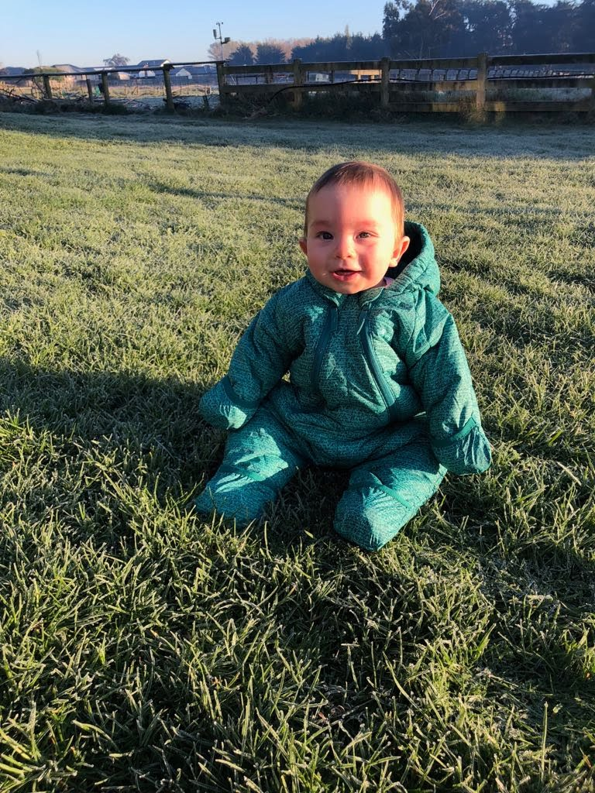
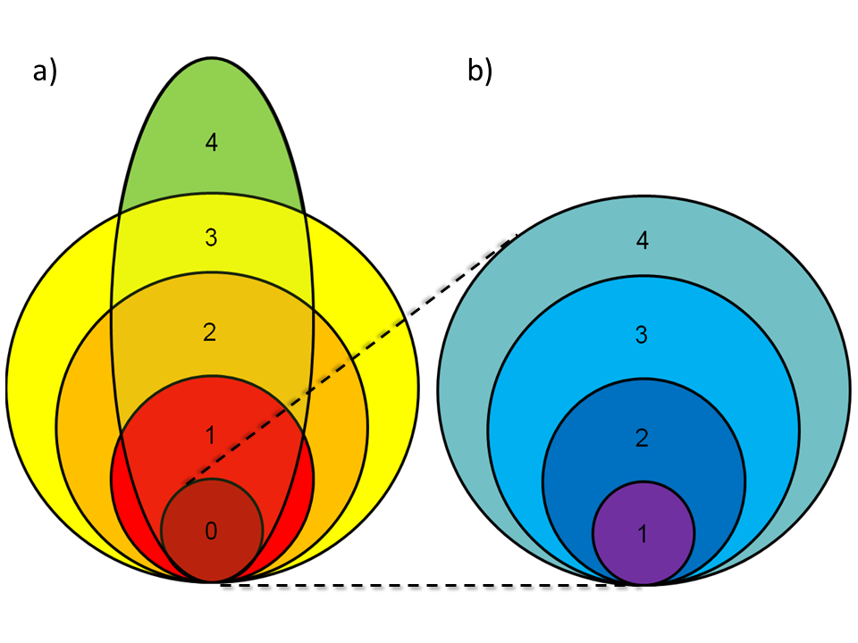

class: middle

```{r setup, include=FALSE}
options(htmltools.dir.version = FALSE)
options(knitr.table.format = "html") 
# require(DT)
```

# .center[Advocate for reproducible research...]

## .center[Where possible my presentations and code are available online]

<br />

<p>
.center[


]
</p>

<br />

.center[[sirselim.github.io/presentations](http://sirselim.github.io/presentations)]

---
class: middle inverse

<p> 
.center[]
</p>

---
class: middle inverse

# ESR (2<sup>nd</sup> July 2018 - )

## Wellington (Porirua), NZ

### <span style="color:#3498DB">Senior Scientist Bioinformatics and Data Science</span>

---
layout: false

background-image: url("images/desk.jpg")
background-size: cover

---
class: middle inverse

# QUT (Feburary 2014 - June 2018)

## Brisbane (QLD), Australia

### <span style="color:#3498DB">PostDoc Research Fellow</span>

---
layout: false

background-image: url("images/proton2.jpg")
background-size: cover

---
class: middle

# Diagnostics Lab

.large[Gene panel and Exome Sequencing (NATA accredited - neurological disorders)]

<br>

## VCF-DART (the pipeline)

* used to manually work through 30-60K rows of data in Excel!
* could take 4-8 weeks to identify and validate variant(s)

<br>

* now can have a short list of variants in <span style="color:#3498DB">**1 day**</span> 
* validation in <span style="color:#3498DB">**<2 weeks**</span>

---
class: middle inverse

# VCF-DART - what it's not...

It is **NOT** a variant calling and quality control pipeline

---

# Overview

<p> 
.center[]
</p>

---

# Variant tiers

<p> 
.center[]
</p>

---
class: middle inverse

# "Module 1" - VCF-DART

---
layout: false

background-image: url("images/vcfdart_1.png")
background-size: contain

---
layout: false

background-image: url("images/vcfdart_2.png")
background-size: contain

---
class: middle

# Runtime

.huge[30-50K variants (avg Proton exome VCF):]

  - 6-10 mins (24 core 256GB RAM)
  - 17-23 mins (4 core 12GB RAM)

---
class: middle inverse

# "Module 2" - VCF-DART Viewer

---
class: middle center

.huge[[...live demonstration...](https://43.240.99.48/sample-apps/WES_ShinyDiscover/)]

<br>

.huge[**?**]

---
layout: false

background-image: url("images/backup_1.png")
background-size: contain

---
layout: false

background-image: url("images/backup_2.png")
background-size: contain

---
layout: false

background-image: url("images/backup_3.png")
background-size: contain

---
layout: false

background-image: url("images/backup_4.png")
background-size: contain

---
layout: false

background-image: url("images/backup_5.png")
background-size: contain

---
layout: false

background-image: url("images/backup_6.png")
background-size: contain

---
class: 

<p> 
.center[]
</p>

Spun up VM to give reviewers a chance to ~~break~~ test things.

* using 6 public exomes (1000G)

<br>

--

.large[**Allocated VM:**]

* Ubuntu 18.08
* 4 cores
* 12GB RAM
* 30GB root
* 120GB emphemral disk

--

<br>

...so it can scale down to quite reasonable specs...

---
class: middle inverse

# to-do

* ~~submit~~ manuscript - out for review (Genetics in Medicine) 
* finish implementing ClinGen links
* option for GnomAD-beta
* refactoring main code base (bpipe)
* complete docker version
* continue developing documentation!
* work with clinicians to further develop and refine

---
class: top

# acknowledgements

<div id="images">
    <a href="http://xyz.com/hello">
        
        <div class="caption">Dr Robert Smith (QUT)</div>
    </a>
    <a href="http://xyz.com/hi">
         
        <div class="caption">Dr Donia Macartney-Coxson (ESR)</div>
    </a>
</div>


Craig Windell (QUT)

Sam Beardman

QRISCloud / Nectar 

---
class: middle inverse

<p>
.huge[.center[<b>Thank you!</b>]]
<br>
</p>