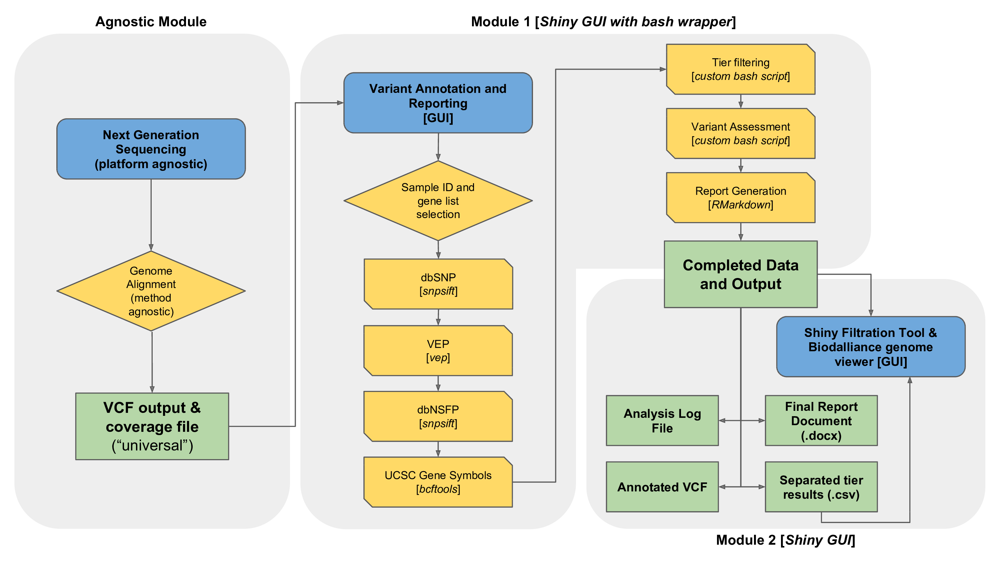

class: middle

```{r setup, include=FALSE}
options(htmltools.dir.version = FALSE)
options(knitr.table.format = "html") 
# require(DT)
```

# .center[Advocate for reproducible research...]

## .center[Where possible my presentations and code are available online]

<br />

<p>
.center[


]
</p>

<br />

.center[[sirselim.github.io/presentations](http://sirselim.github.io/presentations)]

<!-- --- -->
<!-- class: middle inverse -->

<!-- # ESR (2<sup>nd</sup> July 2018 - ) -->

<!-- ## Wellington (Porirua), NZ -->

<!-- ### <span style="color:#3498DB">Senior Scientist Bioinformatics and Data Science</span> -->

---
layout: false

background-image: url("images/pipeline_1.jpg")
background-size: contain

.massive[Pipeline Development]

---
class: middle inverse

# VCF-DART - what it's not...

It is **NOT** a variant calling and quality control pipeline

... it's about data

---

# Overview

<p> 
.center[]
</p>

---
class: middle inverse

# "Module 1" - VCF-DART

---
layout: false

background-image: url("images/vcfdart_1.png")
background-size: contain

---
layout: false

background-image: url("images/vcfdart_2.png")
background-size: contain

---
class: middle

# Runtime

.huge[30-50K variants ("average" human exome VCF):]

  - 6-10 mins (24 core 256GB RAM)
  - 17-23 mins (4 core 12GB RAM)

---
class: middle inverse

# "Module 2" - VCF-DART Viewer

---
class: middle center

.huge[[...live demonstration...](https://43.240.99.48/sample-apps/WES_ShinyDiscover/)]

<br>

.huge[**?**]

---
layout: false

background-image: url("images/backup_1.png")
background-size: contain

---
layout: false

background-image: url("images/backup_2.png")
background-size: contain

---
layout: false

background-image: url("images/backup_3.png")
background-size: contain

---
layout: false

background-image: url("images/backup_4.png")
background-size: contain

---
layout: false

background-image: url("images/backup_5.png")
background-size: contain

---
layout: false

background-image: url("images/backup_6.png")
background-size: contain

---
class: 

<p> 
.center[]
</p>

Spun up VM to give reviewers a chance to ~~break~~ test things.

* using 6 public exomes (1000G)

<br>

--

.large[**Allocated VM:**]

* Ubuntu 18.08
* 4 cores
* 12GB RAM
* 30GB root
* 120GB ephemeral disk

--

<br>

...so it can scale down to quite reasonable specs...

---
class: middle

## Summary

* open source
* modular (tools and databases)
* scalable (laptops -> servers -> HPC)
  * potential to launch as Azure or AWS service
* easy to deploy and use

<br>

Manuscript under revision at [The Journal of Molecular Diagnostics](https://jmd.amjpathol.org/)

---
layout: false

background-image: url("images/clinical_DNA.jpg")
background-size: cover

.massive[Clinical Exomes]

---
class: inverse middle

## <span style="color:#3498DB">{service}</span> Wellington Regional Genetics Lab

* clinical exome (~5000 targeted genes)
* successful first run (8 samples)
  * another 8 about to be run
* looking to ESR for sequencing and bioinformatics expertise
  * also training
* this addresses a major 'gap' for Wellington health care
* service contract on the horizon (monthly sequencing)
* additionally: 15 whole genomes (data)

---
class: inverse middle

## <span style="color:#3498DB">{research}</span> Capital & Coast DHB (Wellington Hospital)

* 50 "whole" exomes - hyperthyroidism
  * appears much more prevalent in NZ (genetics??) 
  * includes family trios
* research collaboration initially
* aiming for a diagnostic test
  * course of action planning
  * depending on the type, surgery not required

---
layout: false

background-image: url("images/NVIDIA_Tesla.jpg")
background-size: cover

.massive[GPUs]

---
class: middle

# GPUs (Graphics Processing Units)

## <span style="color:#3498DB">**Orac**</span> - Data science server

* 36 cores (72 threads)
* 512GB RAM
* 2 x Nvidia Tesla V100 GPUs
  * 32GB RAM
  * 5120 cuda cores
  * 640 Tensor cores
  * Deep learning 112 teraFLOPS

<center>Allows us to test variant callers such as <b>Deepvariant</b></center>

---

## First Deepvariant test

* Genome in a bottle sample (HG001) 
* variant calling done in <span style="color:#3498DB">**45 seconds**</span>
* <span style="color:#3498DB">**99.93%** accuracy</span> against "truth" data

--

<br>

* additional testing underway
  * comparison between 3 different calling methods
  * final design likely to be a combination of several tools
  
--

<br>

* look to incorporate into our pipelines 
  * (human and non-human)

---
class: middle inverse

.massive[<center>...</center>]