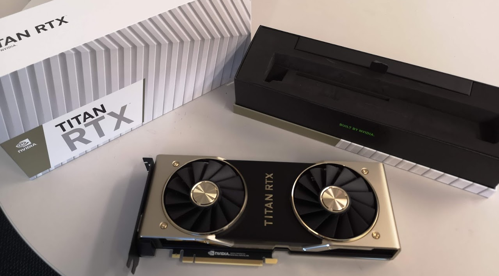

class: middle

```{r setup, include=FALSE}
options(htmltools.dir.version = FALSE)
options(knitr.table.format = "html") 
# require(DT)
```

# .center[Advocate for reproducible research...]

## .center[Where possible my presentations and code are available online]

<br />

<p>
.center[


]
</p>

<br />

.center[[sirselim.github.io/presentations](http://sirselim.github.io/presentations)]

---
class: middle


.center[.huge[
[www.genomics-aotearoa.org.nz](www.genomics-aotearoa.org.nz)

[github.com/GenomicsAotearoa](https://github.com/GenomicsAotearoa)
]]

---
class: middle

# GPU basecalling (live demo part 1)

<br> 

data: mixed bacterial sample, ~0.5 Mb (or ~5.5 Gb actual data)

```{r, engine='bash', eval=F}
# fast basecalling mode
guppy_basecaller \
  --disable_pings \
  --compress_fastq \
  -c dna_r9.4.1_450bps_fast.cfg -i fast5/ \
  -s flongle_test \
  -x 'auto' \
  --recursive \
  --num_callers 4 \
  --gpu_runners_per_device 8 \
  --chunks_per_runner 256
```

<br>

.pull.right[<span style="color:#3498DB">... **que to start ~~trial by fire~~ the first demo** ...</span>]

---
class: middle

# while that's running...

---
layout: false
class: middle inverse

background-image: url("https://cdn.vox-cdn.com/thumbor/llQlREwACaitewdPcLm5HzWT_g0=/0x1:1100x734/920x613/filters:focal(0x1:1100x734):format(webp)/cdn.vox-cdn.com/imported_assets/1507663/DNA-sequence.jpg")
background-size: cover

.massive[**Genomic sequencing**]

---
class: top

# what are we doing?

.large[
Portable ‘real-time’ sequencing for the masses?
]

--

* <span style="color:#3498DB">**the idea**</span>

  * low cost
  * accessible
  * portable
  * fun!

--
  
* <span style="color:#3498DB">**example use cases**</span>

  * field sequencing (real-time monitoring, forensics, forestry, ...)
  * clinical
  * community outreach / teaching
  
---
layout: false
class: middle

<p>
.center[

]
</p>

.small[.center[
(image source: [illumina.com](https://www.illumina.com/techniques/sequencing/dna-sequencing.html))
]]

---
layout: false
class: middle

<p>
.center[

]
</p>

---
layout: false

background-image: url("images/david_slide.png")
background-size: contain

<a href="https://f1000research.com/slides/8-1947" style="position:absolute; top:638px; left:190px">kindly supplied by David Eccles (f1000 presentation)</a>

---
layout: false
class: middle


.small[.center[
(image source: [tombo manual](https://nanoporetech.github.io/tombo/plotting.html))
]]

---
class: middle

# Why GPUs?

.pull-left[
New type of sequencing data requires new type of 'analysis'

* squiggle data lends itself nicely to neural nets
* GPUs are very capable in this space

<br>

ESR GPU basecalling benchmarks [(link)](https://esr-nz.github.io/gpu_basecalling_testing/gpu_benchmarking.html)
]

.pull-right[

]

<br>

.small[.center[
[UPDATE:] guppy is now able to scale across mutiple GPUs!
]]

---
class: middle

# Our experiences with the Xavier [(link)](https://hackmd.io/@Miles/HkumH7sBH)

.pull-left[.right[


]]

.pull-right[.left[


]]

.center[

]

---
class: top

# Benchmarking [(link)<sup>*</sup>](https://gist.github.com/sirselim/2ebe2807112fae93809aa18f096dbb94)

.small[
\* spoilers for those following along live
]

--

<br>

Most Jetson devices have the ability to be put into different power modes

<br>

```{r, echo=FALSE}
tflops <- read.delim('power_table.txt', head = T, as.is = F)
# knitr::kable(tflops, 'html')
DT::datatable(
  head(tflops, 10),
  fillContainer = FALSE, rownames= FALSE, options = list(dom = 't')
)
```
.small[
***Note:*** this table represents basecalling perfomed when running on a portable powerbank.
]

---
class: top

## Very rough comparison of Nvidia ecosystem<sup>#</sup>

```{r, echo=FALSE}
tflops <- read.delim('tflop_table.txt', head = T, as.is = F)
# knitr::kable(tflops, 'html')
DT::datatable(
  head(tflops, 10),
  fillContainer = FALSE, rownames= FALSE, options = list(dom = 't')
)
```

.small[Price in USD]  
.small[<sup>#</sup> a very small selection of what Nvidia offers obviously!]  
.small[\* [Available March 2020](https://developer.nvidia.com/embedded/jetson-xavier-nx), this can fit in an existing Jetson Nano board]

---
class: middle

# Results...?

<br>

.pull.right[
<span style="color:#3498DB">... **que to open the terminal** ...</span>
]

---
class: middle

# Case study (live demo part 2)

## Clinical metagenomics

<br> 

.pull.right[<span style="color:#3498DB">... **que to start the second demo** ...</span>]

---
class: middle

<p>
.center[


]
</p>

---
class: top

# case study

.large[
<br>

* had a lumbar puncture ('9 days' old) 
  * (after being born 8 weeks early)

<br>

* suspected meningitis (bacteria/viral)?
 * told after the fact

<br>

* \>**48 hours** for results return

]

---
class: top

# case study

.large[
... imagine a more ‘real-time’ procedure:
]

<br>

--

.large[
* a sample (i.e. blood) taken,
* DNA/RNA extracted/enriched,
* sequencing library prepared,
* nanopore sequencing initiated,
* sequence starts coming in almost instantly,
* **<span style="color:#3498DB">time to first read-match detection <1 hr</span>**

]

--

<br>

.center[.huge[
**This isn't a stretch of the imagination anymore, soon to be reality**
]]

---
class: middle

# Results...?

<br>

.center[
## BLAST [blastn](https://blast.ncbi.nlm.nih.gov/Blast.cgi?PROGRAM=blastn&PAGE_TYPE=BlastSearch&LINK_LOC=blasthome)
]

---
class: middle

<iframe src="taxonomy.krona.html" onload='javascript:(function(o){o.style.height=o.contentWindow.document.body.scrollHeight+"px";}(this));' style="height:90%;width:100%;border:none;overflow:hidden;"></iframe>

---
class: middle

### What's actually in there?

<br>

.large[

Mixed sample of bacterial species:

> 18AR0083 Enterobacter cloacae  
> 18AR0155 Klebsiella pneumoniae  
> 18AR0156 Escherichia coli  
> 18AR0164 Escherichia coli

]

---
class: middle

# Summary ...

## ... if things haven't crashed and burned ...

---
class: top

# acknowledgements

<div id="images">
    <a href="http://xyz.com/hello">
        
        <div class="caption"><span style="color:#3498DB">Richard Dean (ESR)</span></div>
    </a>
    <a href="http://xyz.com/hello">
        
        <div class="caption"><span style="color:#3498DB">Joep de Ligt (ESR)</span></div>
    </a>
</div>

.pull-left[.medium[
Donia Macartney-Coxson (ESR)  
Una Ren (ESR)  
Matt Storey (ESR)
]]

.pull-right[.medium[
Shane Sturrock (ESR)  
Russell Smithies (ESR)  
Graham Ogdon (ESR)  

David Eccles (Malaghan, Gringene Bioinformatics)
]]