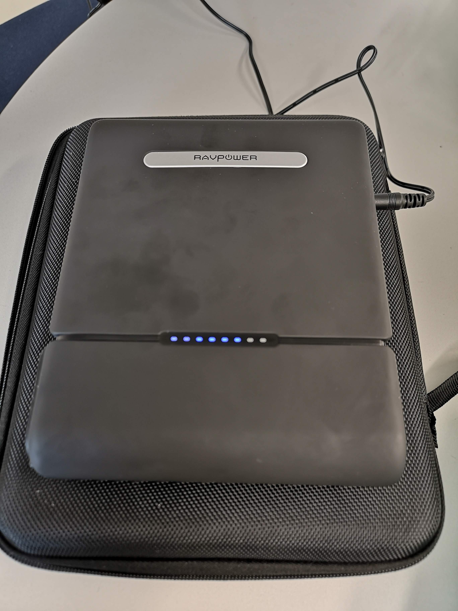

class: middle

```{r setup, include=FALSE}
options(htmltools.dir.version = FALSE)
options(knitr.table.format = "html") 
# require(DT)
```

# .center[Advocate for reproducible research...]

## .center[Where possible my presentations and code are available online]

<br />

<p>
.center[


]
</p>

<br />

.center[[sirselim.github.io/presentations](http://sirselim.github.io/presentations)]

???

These are my presenter notes. :)

These links throughout are a combination of github and hackMD, all should be available.

---
class: middle


.center[.huge[
[www.genomics-aotearoa.org.nz](www.genomics-aotearoa.org.nz)

[github.com/GenomicsAotearoa](https://github.com/GenomicsAotearoa)
]]

???

Part of the Bioinformatics Leadership Team, for health.

---
class: middle

# GPU basecalling (live demo part 1)

<br> 

data: mixed bacterial sample, ~0.5 Mb (or ~5.5 Gb actual data)

```{r, engine='bash', eval=F}
# fast basecalling mode
guppy_basecaller \
  --disable_pings \                            # don't call home
  --compress_fastq \
  -c dna_r9.4.1_450bps_fast.cfg \              # model file
  -i fast5/ \                                  # input dir (fast5 files)
  -s flongle_test \                            # output dir
  -x 'auto' \                                  # GPU configuration
  --recursive \
  --num_callers 4 \
  --gpu_runners_per_device 8 \
  --chunks_per_runner 256
```

.pull.right[<span style="color:#3498DB">... **que to start ~~trial by fire~~ the first demo** ...</span>]

???

Notes

---
class: middle

# while that's running...

???

A little genomics 101...

---
layout: false
class: middle inverse

background-image: url("https://cdn.vox-cdn.com/thumbor/llQlREwACaitewdPcLm5HzWT_g0=/0x1:1100x734/920x613/filters:focal(0x1:1100x734):format(webp)/cdn.vox-cdn.com/imported_assets/1507663/DNA-sequence.jpg")
background-size: cover

.massive[**Genomic sequencing**]

???

DNA - A, T, C, G
Part of all 'living' things

---
class: top

# what are we doing?

.large[
Portable ‘real-time’ sequencing for the masses?
]

--

* <span style="color:#3498DB">**the idea**</span>

  * low cost
  * accessible
  * portable
  * fun!

--
  
* <span style="color:#3498DB">**example use cases**</span>

  * field sequencing (real-time monitoring, forensics, forestry, ...)
  * clinical
  * community outreach / teaching
  
---
layout: false
class: middle

<p>
.center[

]
</p>

.small[.center[
(image source: [illumina.com](https://www.illumina.com/techniques/sequencing/dna-sequencing.html))
]]

???

I used the word portable in my previous slide, this is not a phrase one would attribute to machines from Illumina / PacBio.

These things are huge! ... and expensive.

---
layout: false
class: middle

<p>
.center[

]
</p>

.small[.center[
(image source: [nanoporetech](https://nanoporetech.com/about-us/news/oxford-nanopore-announces-ps100-million-140m-fundraising-global-investors))
]]

???

flongle: ~$500 USD for 5
1 might be enough for a metagenome

minION: $1000 

smidgION: still just a concept

gridION: ~$50K

promethION: ~$230K

---
layout: false

background-image: url("images/david_slide.png")
background-size: contain

<a href="https://f1000research.com/slides/8-1947" style="position:absolute; top:625px; left:190px">kindly supplied by David Eccles (f1000 presentation)</a>
<a href="https://www.youtube.com/watch?v=CHCAb-PAqUI" style="position:absolute; top:652px; left:190px">Sequencing DNA with Linux Cores and Naopores</a>

???

David's talk and a live demo are linked.

---
layout: false
class: middle

# Example squiggle plot


.small[.center[
(image source: [tombo manual](https://nanoporetech.github.io/tombo/plotting.html))
]]

???

What we 'see' when DNA passes through the pores.

---
class: middle

# Why GPUs?

.pull-left[
New type of sequencing data requires new type of 'analysis'

* squiggle data lends itself nicely to neural nets
* GPUs are very capable in this space
  - CUDA cores


ESR GPU basecalling benchmarks [(link)](https://esr-nz.github.io/gpu_basecalling_testing/gpu_benchmarking.html)
* Titan RTX & 2x Telsa V100
]

.pull-right[

]

<br>

.small[.center[
[UPDATE:] guppy is now able to scale across mutiple GPUs!
]]

---
class: middle

# Our experiences with the Xavier [(link)](https://hackmd.io/@Miles/HkumH7sBH)

.pull-left[.right[


]]

.pull-right[.left[


]]

.center[

]

???

Talk about the Xavier specs:

 * 8 core arm 
 * 16 GB of RAM
 * 512 CUDA core and 64 tensor cores
 * 512 GB SSD NVMe

---
class: top

# Benchmarking [(link)<sup>*</sup>](https://gist.github.com/sirselim/2ebe2807112fae93809aa18f096dbb94)

.small[
\* spoilers for those following along live
]

--

<br>

Most Jetson devices have the ability to be put into different power modes

<br>

```{r, echo=FALSE}
tflops <- read.delim('power_table.txt', head = T, as.is = F)
# knitr::kable(tflops, 'html')
DT::datatable(
  head(tflops, 10),
  fillContainer = FALSE, rownames= FALSE, options = list(dom = 't')
)
```
.small[
***Note:*** this table represents basecalling perfomed when running on a portable powerbank.
]

???

Why is 10W mode exciting?

We're running in 30W MAX mode for this live demo - running on a portable powerpack.

---
class: top

## Very rough comparison of Nvidia ecosystem<sup>#</sup>

```{r, echo=FALSE}
tflops <- read.delim('tflop_table.txt', head = T, as.is = F)
# knitr::kable(tflops, 'html')
DT::datatable(
  head(tflops, 10),
  fillContainer = FALSE, rownames= FALSE, options = list(dom = 't')
)
```

.small[Price in USD]  
.small[<sup>#</sup> a very small selection of what Nvidia offers obviously!]  
.small[\* [Available March 2020](https://developer.nvidia.com/embedded/jetson-xavier-nx), this can fit in an existing Jetson Nano board]

???

V100 could rip through this data in a couple of mins, but consider the cost, power, etc.

Xavier NX is exciting, module that can slot into the Nano body [**hold up Nano device**]

---
class: middle

# Results...?

<br>

.pull.right[
<span style="color:#3498DB">... **que to open the terminal** ...</span>
]

???

Show completed run, time and other metrics.

Also open/show head of a fastq file (cat it and take a long read to blast)

---
class: middle

# Case study (live demo part 2)

## Clinical metagenomics

<br> 

.pull.right[<span style="color:#3498DB">... **que to start the second demo** ...</span>]

---
class: middle

<p>
.center[


]
</p>

---
class: top

# case study

.large[
<br>

* had a lumbar puncture ('9 days' old) 
  * (after being born 8 weeks early)

<br>

* suspected meningitis (bacteria/viral)?
 * told after the fact

<br>

* \>**48 hours** for results return

]

---
class: top

# case study

.large[
... imagine a more ‘real-time’ procedure:
]

<br>

--

.large[
* a sample (i.e. blood) taken,
* DNA/RNA extracted/enriched,
* sequencing library prepared,
* nanopore sequencing initiated,
* sequence starts coming in almost instantly,
* **<span style="color:#3498DB">time to first read-match detection <1 hr</span>**

]

--

<br>

.center[.huge[
**This isn't a stretch of the imagination anymore, soon to be reality**
]]

???

Stress how fast and low cost this has the potential to be.

---
class: middle

# Results...?

<br>

.center[
## BLAST [blastn](https://blast.ncbi.nlm.nih.gov/Blast.cgi?PROGRAM=blastn&PAGE_TYPE=BlastSearch&LINK_LOC=blasthome)
]

```{r, engine='bash', eval=F}
zcat flongle_test/fastq_runid_3b07b3e214d5928e9ae59bd18918e7298d4f601b_20_0.fastq.gz | \
  paste - - - - | \
  awk -F '\t' '{L=length($2);if(L>M) {M=L;R=$0;}} END {print R;}' | \
  tr "\t" "\n" | \
  sed -n 2p
```

???

Take an example read and blast it.

Quick and dirty oneliner to find the longest read in a fastq file, we can then paste this into our blast window and hopefully identify a speices of bacteria...

---
class: middle

<iframe src="taxonomy.krona.html" onload='javascript:(function(o){o.style.height=o.contentWindow.document.body.scrollHeight+"px";}(this));' style="height:90%;width:100%;border:none;overflow:hidden;"></iframe>

---
class: middle

### What's actually in there?

<br>

.large[

Mixed sample of bacterial species:

> 18AR0083 Enterobacter cloacae  
> 18AR0155 Klebsiella pneumoniae  
> 18AR0156 Escherichia coli  
> 18AR0164 Escherichia coli

]

???

Success!

---
class: middle

# Summary ...

<br>

## ... if things haven't crashed and burned ...

???

Again reiterate:

* cost
* portability
* accesible - off the shelf parts
* fast
* GPU tech scaled down
* MANY use cases

---
class: top

# acknowledgements (people to 'nerd' out with!)

<div id="images">
    <a href="http://xyz.com/hello">
        
        <div class="caption"><span style="color:#3498DB">Richard Dean (ESR)</span></div>
    </a>
    <a href="http://xyz.com/hello">
        
        <div class="caption"><span style="color:#3498DB">Joep de Ligt (ESR)</span></div>
    </a>
</div>

.pull-left[.medium[
Donia Macartney-Coxson (ESR)  
Una Ren (ESR)  
Matt Storey (ESR)
]]

.pull-right[.medium[
Shane Sturrock (ESR)  
Russell Smithies (ESR)  
Graham Ogdon (ESR)  

David Eccles (Malaghan, Gringene Bioinformatics)
]]